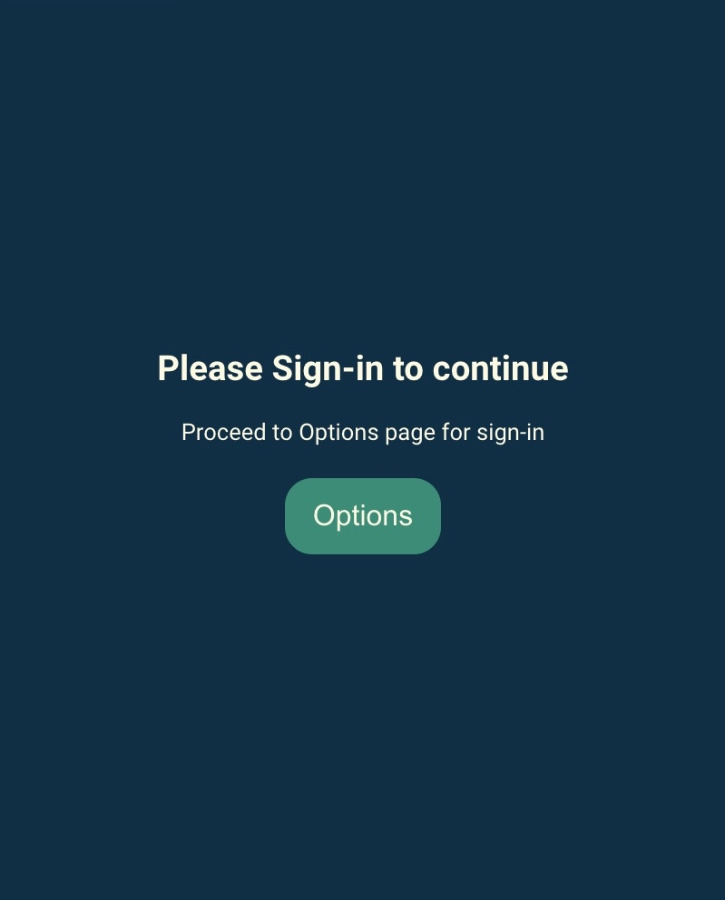
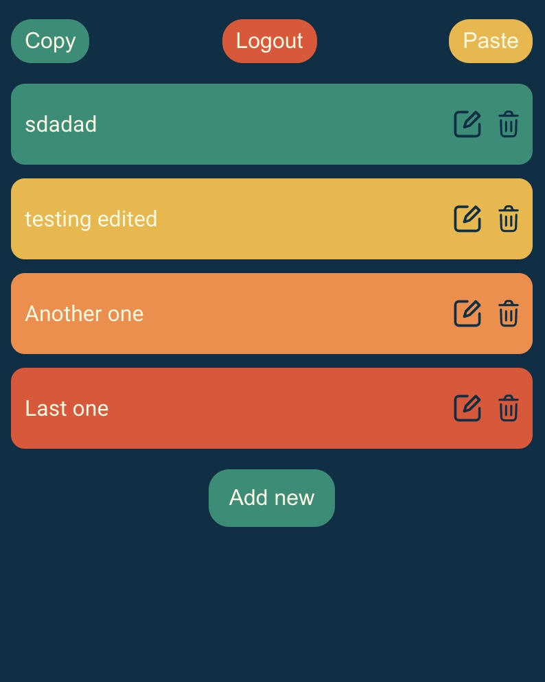
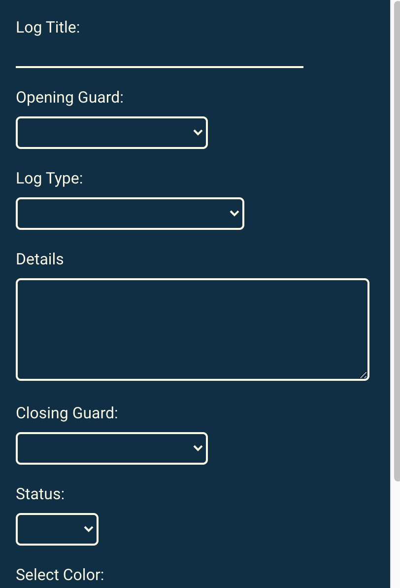

# TAMC Extension

Chrome extension created for **Telstra** Alarm Monitoring Centre for their day to day use. It increased the productivity of staff by automating the repetitive task of filling out forms. Extension can be downloaded at: [Download Extension](https://drive.google.com/file/d/1CAJjLTR7ySMBXcVrcja9nlRzhwXA2U4Y/view?usp=sharing).  

(_Please note the extension is specifically created for a specific website with a very specific usecase. So it won't work on all forms_). _To see the extension in action, you can try it out in the sample forms [Daily Log](https://daily-log.netlify.app/) & [Patrols](https://patrol-dispatch.netlify.app/). The auto-form fill feature as shown in the 2nd gif will only work with [Daily Log](https://daily-log.netlify.app/). While copy paste values functionality(3rd gif) is uni-directional i.e. daily log --> Patrol dispatch._

### Tech Stack:

---

MERN (MongoDb, Express, React & Node) Stack Application.

### UI Screenshots:

---

### How to install:

---

Turn on developer mode and drag and drop the .crx file on the extension page. Works with most chromium based browers including Google chrome, Microsoft Edge, Opera etc.

### Features:

---

- Authentication via Auth0

  

- Add and edit logs

  

- Copy values between forms

  

### Upcoming Features:

---

- Ability to reorder posts by drag to re-order
- Implementing Redis caching for performance improvements.
- Animations and UI/UX improvements
- General use version that can be used for auto-filling any form on the web.
