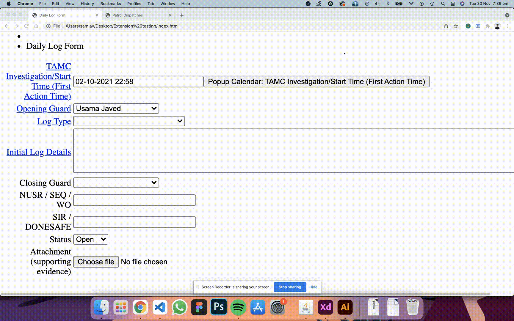
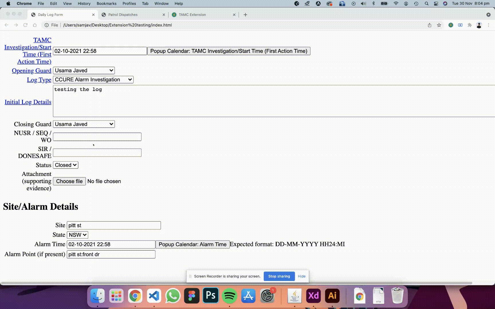

# TAMC Extension

Chrome extension created for <b>Telstra</b> Alarm Monitoring Centre for their day to day use. It increased the productivity of staff by automating the repetitive task of filling out forms. Extension can be downloaded at: [Download Extension](https://drive.google.com/file/d/1zvS1Mt58XT-5KGHisGWJjdlhbPOudE0k/view?usp=sharing).  

(_Please note the extension is specifically created for a specific website so it won't work on all forms_)

## Tech Stack:

MERN (MongoDb, Express, React & Node) Stack Application.

## Features:

- Authentication via Auth0

  

- Add and edit logs

  

- Copy values between forms

  

## Upcoming Features:

- Ability to reorder posts by drag to re-order
- Animations and UI/UX improvements
- General use version that can be used for auto-filling any form on the web.
